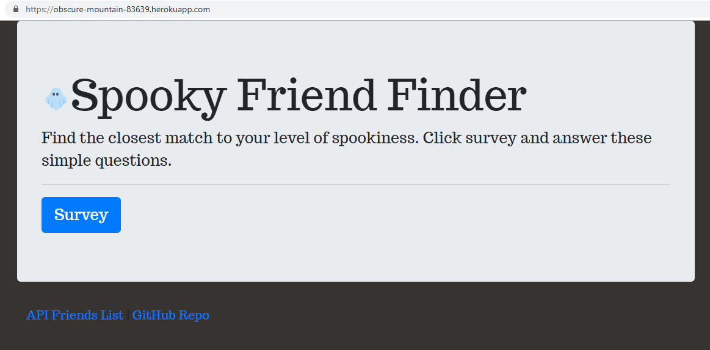
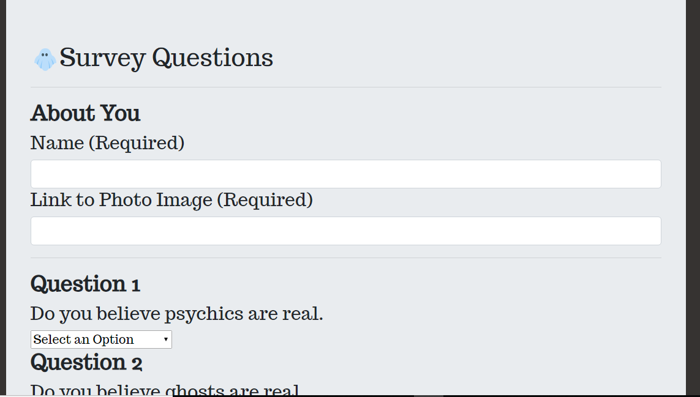

 # Spooky Friend Finder #

Spooky Friend Finder is a simple full stack applicatio

 ## Overview ##
 In this project I built a compatibility-based "FriendFinder" application -- basically a dating type app. This full-stack site takes in results from your users' surveys, then compare their answers with those from other users. The app will then display the name and picture of the user with the best overall match.

I used Express to handle routing. The app was deployed to Heroku so other users can fill it out.

 
 
 
 
  

 [Link to application](https://obscure-mountain-83639.herokuapp.com/)
